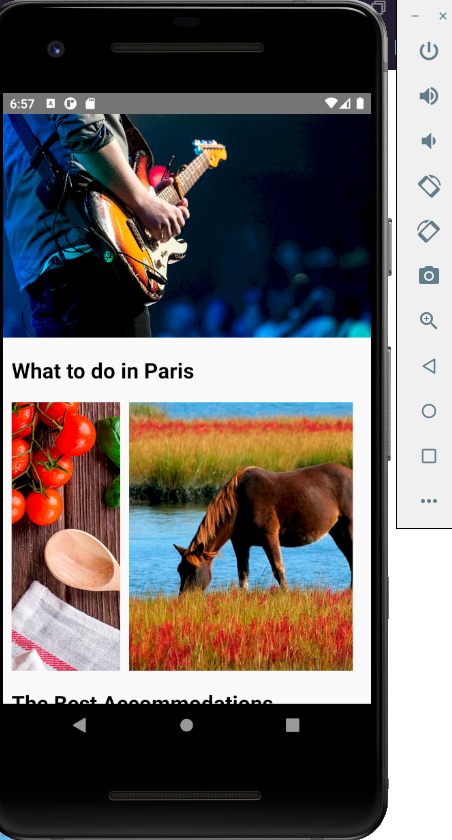
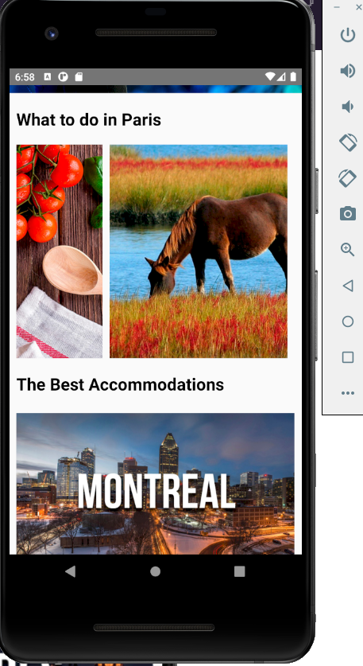
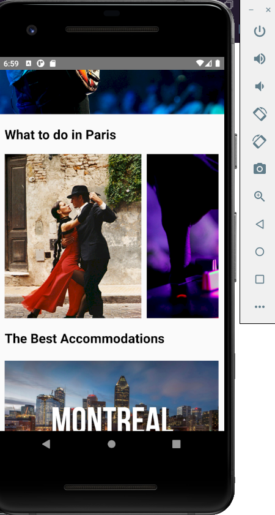
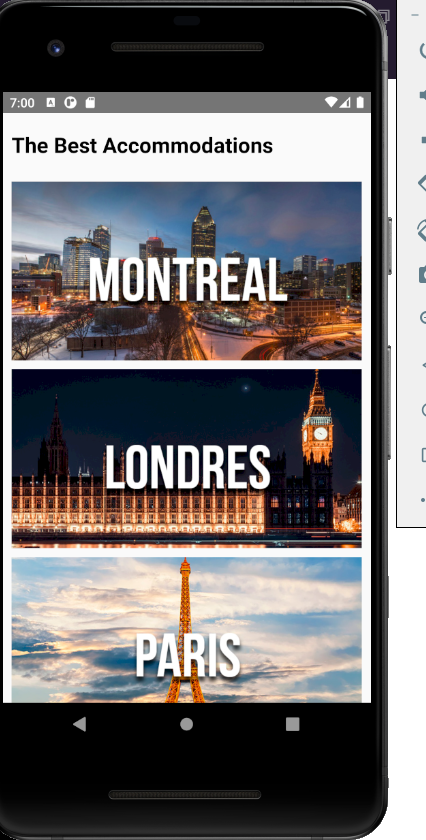
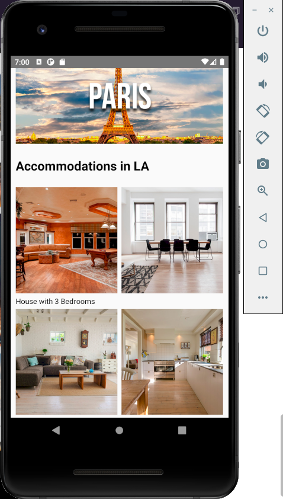

# Layout app

## _Framework: React native_

## Features

- React Native Client
- flex-box
- React Native components such as:
  - View StyleSheet
  - Image
  - Text
  - ScrollView

## Installation

This app use Node.js v16.0.0+ to run.

Install the dependencies and devDependencies and start the server.

```sh
cd carousel_app_puzzle_2
npm i
 start proyect android
 npx react-native run-android
 start proyect IOS
  npx react-native run-ios
```

## License

MIT

**Free Software, Hell Yeah!**






